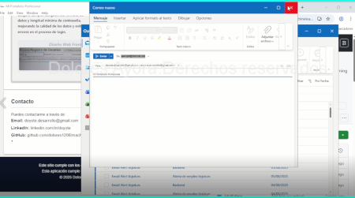

<!-- googlebot noindex -->

# Portafolio Profesional

Este repositorio contiene el código fuente de **Portafolio Profesional**, una aplicación desarrollada por **D. A. T.**

## Nota sobre la versión del proyecto

Este repositorio contiene una versión demo técnica y limitada del proyecto **Portafolio Profesional**.  
La versión completa y avanzada, que incluye arquitectura más compleja, lógica extendida y validaciones adicionales, se mantiene privada y puede ser presentada bajo solicitud, en una entrevista o con acuerdo de confidencialidad (NDA).

Las imágenes y validaciones aquí mostradas incluyen procesos técnicos tanto de la demo pública como de la versión privada avanzada, para evidenciar el nivel profesional y cuidado aplicado en el desarrollo.

Para más información o acceso a la versión completa, por favor contacta a:  
**doyote.desarrollo@gmail.com**

> **AVISO IMPORTANTE:**  
> Este software se proporciona exclusivamente para su **visualización personal** como parte del portafolio técnico de la autora.  
> Su consulta está permitida únicamente con fines de **evaluación profesional**, **revisión técnica** o **análisis no comercial**.

> **Queda estrictamente prohibido** su uso comercial, copia, distribución, modificación, integración, o publicación total o parcial,  
> sin el **consentimiento previo, expreso y por escrito** de la autora.

> Para obtener una **licencia de uso profesional o comercial**, contacte directamente con la autora.

----

----

## Licencia

Este proyecto está protegido bajo una **licencia propietaria**.  
Todos los derechos reservados © 2025 **D. A. T.**

Este software **no es de código abierto** y **no puede utilizarse con fines comerciales ni personales** sin autorización expresa.

Consulta el archivo `LICENSE.txt` para conocer los términos completos de uso, restricciones y derechos.

----

## Licencias comerciales o personalizadas

Si deseas:

- Obtener una **licencia comercial**
- Solicitar una **adaptación personalizada**
- Integrar este software en un proyecto propio
- Contar con **soporte técnico especializado** o **servicios de integración profesional**

Puedes contactar directamente a:

**doyote.desarrollo@gmail.com**

----

## Auditorías y Validaciones Técnicas

Este software ha sido evaluado antes de su publicación. Se ha confirmado que:

- El marcado HTML/CSS cumple los estándares de W3C
- El diseño cumple los principios de accesibilidad WCAG 2.1 AA
- El código JavaScript  está minificado, validado y ofuscado para protección
- Se han aplicado pruebas automatizadas con Playwright para UI y hooks
- Se realizó un análisis de seguridad estático con reglas Semgrep personalizadas
- Se ha utilizado ESLint para comprobar estilo y calidad del código
- Se bloquea el menú contextual (clic derecho) por razones de seguridad básica

> **Nota:** Por razones de confidencialidad y seguridad, los resultados completos de auditorías y el checklist interno de preproducción no se incluyen en este repositorio público.

> **Esta demo representa una versión simplificada del proyecto.**  
> La versión funcional empaquetada, con documentación técnica, pruebas OWASP y resultados detallados de validación,  
> está disponible bajo solicitud (entrevista, NDA o análisis profesional).

----

### Seguridad del entorno y análisis de dependencias

Se analizaron posibles vulnerabilidades relacionadas con las dependencias del entorno Node.js antes del empaquetado final.

- Se ejecutó `npm audit` y se detectaron 3 paquetes obsoletos o deprecados (`inflight`, `glob`, `boolean`), con impacto considerado bajo.
- Las alertas provienen de dependencias transitivas de `Electron` y `clean-css`, y fueron documentadas.
- Se utilizaron herramientas adicionales como `ESLint`, `Semgrep` (reglas personalizadas) y `OWASP Dependency-Check` y Electron Security Checklist.
-`Snyk` no pudo completarse por un fallo externo en el proceso de registro/verificación.

> La seguridad se validó sobre el código fuente original antes de su minificación y ofuscación, que no se incluye en esta demo pública.

----

### Firma digital del ejecutable

> El instalador `.exe` generado para Windows **no está firmado con un certificado de confianza reconocido por Microsoft**.  
> Esto se debe a que los certificados profesionales (como DigiCert o GlobalSign) **suponen un coste elevado en esta fase** del proyecto.

> Se intentó firmar el ejecutable con un **certificado personal emitido por la FNMT**, pero la herramienta `signtool.exe` lo rechazó al no cumplir los requisitos de confianza para la firma de código.

> Como resultado, Windows puede mostrar advertencias de seguridad (SmartScreen) al ejecutar el instalador, aunque el archivo no contiene código malicioso.

> Esta firma digital podrá integrarse en versiones futuras si el proyecto se distribuye de forma comercial o a mayor escala.

----

## Contacto y colaboración

Para acceder a la versión completa, informes detallados, o para discutir posibles colaboraciones y licencias, contacta a:
**doyote.desarrollo@gmail.com**
